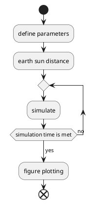

# Planning document

## Goal

## Design

## Overview

```plantuml
@startuml
start
:define parameters;
:earth sun distance;
repeat
  :simulate;
repeat while (simulation time is met) is (no)
-> yes;
:figure plotting;
end

@enduml

```
